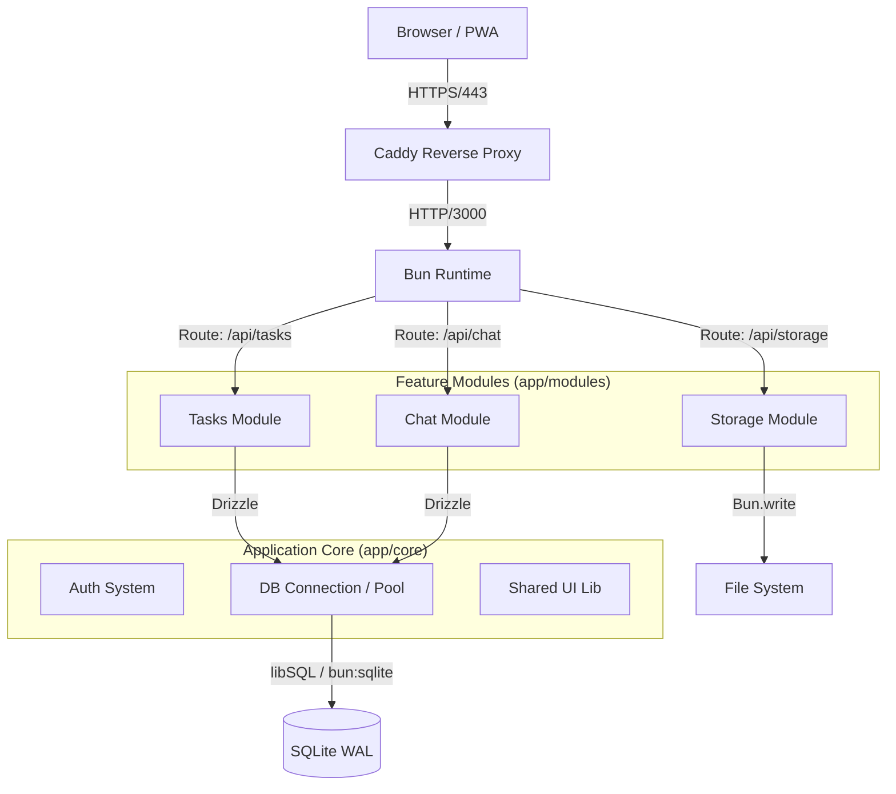
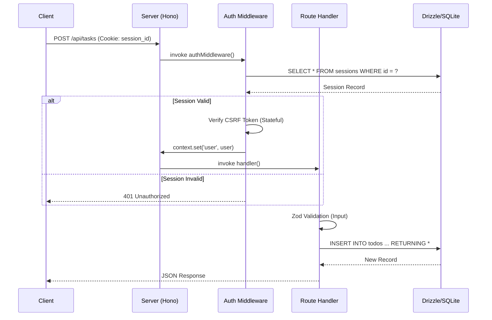

# 📘 LEAN MEAN VPS - Framework Technical Whitepaper

> **Version:** 2.1.0
> **Zielgruppe:** Senior Fullstack Engineers & System Architects
> **Philosophie:** Zero-Runtime-Bloat, Maximale Hardware-Effizienz (512MB RAM), Vertical Slice Architektur.

---

## 1. System Architektur

Das Framework implementiert eine **Vertical Slice Architektur** auf Basis von Bun und Hono. Im Gegensatz zu traditionellen Schichtenarchitekturen (Controller -> Service -> Repo) ist der Code hier nach **Feature Modulen** organisiert.

### 1.1 High-Level Komponenten Diagramm



### 1.2 Request Lifecycle (Sequenz)

Typischer Ablauf eines authentifizierten API Requests (z.B. `POST /api/tasks`):



---

## 2. Core Subsysteme Deep Dive

### 2.1 Datenbank Abstraktion & Build-Time Mocking

Das Projekt nutzt ein spezielles "Build-Time Proxy" Pattern, um Static Site Generation (SSG) via Vite zu ermöglichen, während native Bun APIs verwendet werden.

*   **Problem:** Vite läuft während des Build-Prozesses in Node.js (oder einem Node-Compat Layer). `bun:sqlite` ist ein natives Binary-Modul exklusiv für die Bun Runtime. Der Import während `vite build` führt zum Crash.
*   **Lösung:** `app/core/db/index.ts` erkennt die Umgebung.

```typescript
// app/core/db/index.ts
export async function getDb(): Promise<DbType> {
  // Runtime Detection
  const isBunRuntime = typeof Bun !== 'undefined';

  if (!isBunRuntime) {
    // BUILD-TIME MOCK
    // Gibt einen Proxy zurück, der alle Aufrufe "schluckt" (z.B. db.select()...)
    // und so den Import ermöglicht, ohne Logik auszuführen.
    return createBuildProxy();
  }

  // RUNTIME
  const { Database } = await import('bun:sqlite');
  return drizzle(new Database('data/sqlite.db'));
}
```

### 2.2 Sicherheits-Architektur

#### Authentifizierung (Argon2id)
Wir nutzen `Bun.password`, welches Argon2id implementiert.
*   **Memory Cost:** 32MB (konfiguriert als `32768`).
*   **Time Cost:** 3 Iterationen.
*   **Begründung:** Auf einem 512MB VPS sind 32MB pro Login-Request der Sweetspot zwischen Sicherheit (Resistenz gegen GPU-Cracking) und Stabilität (Vermeidung von OOM Kills bei parallelen Logins).

#### Timing Attack Mitigation
In `app/core/auth/api.ts` implementieren wir eine "Dummy Verifikation":

```typescript
const dummyHash = '$argon2id$...'; // Vorberechnet
const isValid = await verifyPassword(password, user ? user.passwordHash : dummyHash);
```
*   **Mechanismus:** Selbst wenn ein Benutzer nicht gefunden wird, wird die teure Argon2id Verifikation gegen einen Dummy-Hash ausgeführt.
*   **Ergebnis:** Die Antwortzeit für "User nicht gefunden" vs "Falsches Passwort" ist statistisch identisch (~300ms), was User Enumeration verhindert.

#### Session Management
*   **Speicher:** SQLite `sessions` Tabelle.
*   **Cleanup:** Probabilistischer Algorithmus (1% Chance bei Erstellung) triggert `DELETE FROM sessions WHERE expiresAt < NOW()`. Dies vermeidet die Notwendigkeit eines externen Cron-Daemons.

---

## 3. Operations & Deployment

### 3.1 Caddy Konfiguration (Empfohlen)
Caddy dient als TLS Terminator und Edge Layer.

**`Caddyfile` Optimierungen:**
```caddyfile
domain.com {
    # 1. Zstandard Kompression (Schneller & bessere Ratio als Gzip)
    encode zstd gzip

    # 2. Hard Rate Limiting (Layer 7 DDoS Schutz)
    # WARNUNG: Dies ist ein Basisschutz, keine WAF.
    # Es schützt nicht vor Slowloris oder App-Level-Abuse (z.B. Spam).
    rate_limit {
        zone lean_vps_limit {
            key {remote_host}
            events 20
            window 1s
        }
    }

    reverse_proxy localhost:3000
}
```

### 3.2 Systemd Service
Die Anwendung läuft als einzelnes Binary. Das ist extrem ressourcenschonend, bedeutet aber:
*   **Kein Zero-Downtime Deployment:** Bei Updates stoppt der Server kurz.
*   **Availability > Simplicity?** Wenn du 99.999% Uptime brauchst, ist dies nicht dein Stack. Nutze Docker Swarm/K8s (aber nicht mit 512MB RAM).

```ini
# /etc/systemd/system/lean-app.service
[Service]
ExecStart=/path/to/lean-server
# Kritisch für 512MB VPS:
MemoryMax=400M
Restart=always
```

---

## 4. Modul Entwicklungs-Guide

Um ein neues Feature hinzuzufügen (z.B. "Blog"):

1.  **Verzeichnis erstellen:** `app/modules/blog`
2.  **Schema definieren:** `app/modules/blog/schema.ts` (Drizzle Tabellen exportieren)
3.  **Schema registrieren:** Füge `export * from './modules/blog/schema'` zu `app/db.ts` hinzu.
4.  **API erstellen:** `app/modules/blog/api.ts` (Hono Instanz).
5.  **API mounten:** Füge `app.route('/api/blog', blog)` zu `app/api-server.ts` hinzu.
6.  **UI entwickeln:** Erstelle Islands in `app/modules/blog/islands/`.

**Einschränkung:** Module DÜRFEN KEINE Logik voneinander importieren (um zyklische Abhängigkeiten zu vermeiden).
*   **Ausnahme:** `schema.ts` Imports sind erlaubt (Read-Only Type-Safety).
*   **Risiko:** Wenn Module implizit voneinander abhängen (z.B. Task braucht User-ID), wird die DB zum "Hidden God Object". Dokumentiere Abhängigkeiten explizit!

---

## 5. FAQ & Design Entscheidungen

### Warum Bun Native WebSockets für den Chat?
Wir haben uns für Bun's `server.publish()` (Native Pub/Sub) statt Standard JS WebSockets oder SSE für das Chat Modul entschieden.
*   **Performance:** Das Handling von 5000+ Verbindungen in JS (Array-Loops) erzeugt massiven GC-Druck. Bun erledigt dies in nativem C++/Zig Code.
*   **Speicher:** Drastisch geringerer Overhead pro Verbindung.
*   **Analogie:** SSE ist wie ein Postbote, der 5000 Briefe einzeln austrägt. Bun Pub/Sub ist wie ein Rohrpostsystem, wo der Brief automatisch im richtigen Schacht landet.

### SQLite Mock & SSG (Warum?)
**F:** *Brauche ich den `bun-sqlite-mock` wirklich?*
**A:** Ja, für den Build-Prozess.
*   **Problem:** Vite läuft während des SSG-Builds in Node.js. `bun:sqlite` ist Bun-exklusiv und lässt Node abstürzen.
*   **Lösung:** Der Proxy in `app/core/db/index.ts` erkennt die Umgebung und tauscht die echte DB gegen ein Dummy-Objekt aus.
*   **Skalierung:** SQLite WAL Modus skaliert gut, aber ist **nicht** für High-Auth-Throughput (>100 gleichzeitige Writes) gemacht. Für diesen Use-Case ist das Framework nicht gedacht.

### Sicherheit
*   **Auth:** Argon2id (32MB RAM Cost).
*   **Timing Attacks:** Mitigated durch Dummy Hash Verifikation.
*   **Session Cleanup:** Probabilistisch (1% Chance) beim Login.
