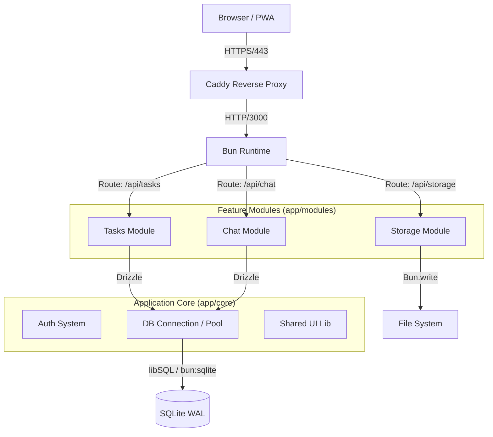
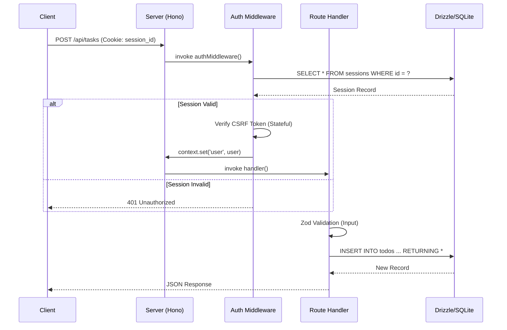

# 📘 LEAN MEAN VPS - Framework Technical Whitepaper

> **Version:** 2.1.0
> **Target Audience:** Senior Fullstack Engineers & System Architects
> **Philosophy:** Zero-Runtime-Bloat, Maximum Hardware Efficiency (512MB RAM), Vertical Slice Architecture.

---

## 1. System Architecture

The framework implements a **Vertical Slice Architecture** on top of Bun and Hono. Unlike traditional Layered Architectures (Controller -> Service -> Repo), code is organized by **Feature Modules**.

### 1.1 High-Level Component Diagram



### 1.2 Request Lifecycle (Sequence)

Typical flow for an authenticated API request (e.g., `POST /api/tasks`):



---

## 2. Core Subsystems Deep Dive

### 2.1 Database Abstraction & Build-Time Mocking

The project uses a unique "Build-Time Proxy" pattern to support Static Site Generation (SSG) via Vite while using native Bun APIs.

*   **Problem:** Vite runs in Node.js (or a Node-compat layer) during the build process. `bun:sqlite` is a native binary module exclusive to the Bun Runtime. Importing it during `vite build` causes a crash.
*   **Solution:** `app/core/db/index.ts` detects the environment.

```typescript
// app/core/db/index.ts
export async function getDb(): Promise<DbType> {
  // Runtime Detection
  const isBunRuntime = typeof Bun !== 'undefined';

  if (!isBunRuntime) {
    // BUILD-TIME MOCK
    // Returns a Proxy that swallows all calls (e.g. db.select()...)
    // ensuring imports work but don't execute logic.
    return createBuildProxy();
  }

  // RUNTIME
  const { Database } = await import('bun:sqlite');
  return drizzle(new Database('data/sqlite.db'));
}
```

### 2.2 Security Architecture

#### Authentication (Argon2id)
We use `Bun.password` which implements Argon2id.
*   **Memory Cost:** 32MB (configured as `32768`).
*   **Time Cost:** 3 iterations.
*   **Rationale:** On a 512MB VPS, dedicating 32MB per login request is the sweet spot between security (resistance to GPU cracking) and stability (preventing OOM kills during concurrent logins).

#### Timing Attack Mitigation
In `app/core/auth/api.ts`, we implement a "Dummy Verification":

```typescript
const dummyHash = '$argon2id$...'; // Pre-calculated
const isValid = await verifyPassword(password, user ? user.passwordHash : dummyHash);
```
*   **Mechanism:** Even if a user is not found, the expensive Argon2id verification is executed against a dummy hash.
*   **Result:** Response time for "User not found" vs "Wrong password" is statistically identical (~300ms), preventing username enumeration.

#### Session Management
*   **Storage:** SQLite `sessions` table.
*   **Cleanup:** Probabilistic algorithm (1% chance on creation) triggers `DELETE FROM sessions WHERE expiresAt < NOW()`. This avoids the need for an external Cron daemon.

---

## 3. Operations & Deployment

### 3.1 Caddy Configuration (Recommended)
Caddy serves as the TLS terminator and Edge Layer.

**`Caddyfile` Optimizations:**
```caddyfile
domain.com {
    # 1. Zstandard Compression (Faster & better ratio than Gzip)
    encode zstd gzip

    # 2. Hard Rate Limiting (Layer 7 DDoS Protection)
    rate_limit {
        zone lean_vps_limit {
            key {remote_host}
            events 20
            window 1s
        }
    }

    reverse_proxy localhost:3000
}
```

### 3.2 Systemd Service
The application runs as a single binary.

```ini
# /etc/systemd/system/lean-app.service
[Service]
ExecStart=/path/to/lean-server
# Critical for 512MB VPS:
MemoryMax=400M
Restart=always
```

---

## 4. Module Development Guide

To add a new feature (e.g. "Blog"):

1.  **Create Directory:** `app/modules/blog`
2.  **Define Schema:** `app/modules/blog/schema.ts` (Export Drizzle tables)
3.  **Register Schema:** Add `export * from './modules/blog/schema'` to `app/db.ts`.
4.  **Create API:** `app/modules/blog/api.ts` (Hono instance).
5.  **Mount API:** Add `app.route('/api/blog', blog)` to `app/api-server.ts`.
6.  **Develop UI:** Create Islands in `app/modules/blog/islands/`.

**Constraint:** Modules MUST NOT import from other modules directly. Use the Database or Event Bus (`app/core/events`) for decoupling.
