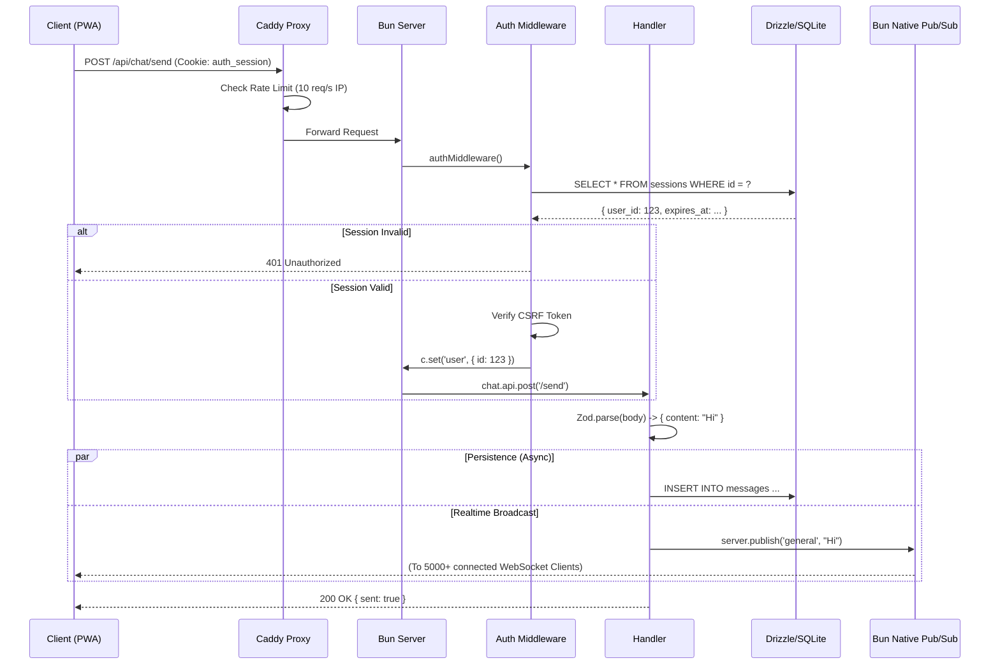

# 📘 LEAN MEAN VPS - Master Documentation

> **Version:** 4.0.0 (Complete Edition)
> **Status:** Production Ready
> **Target Audience:** All Developers (Juniors to Seniors)
> **Mission:** Maximum Performance & Security on Minimal Hardware (1 vCPU, 512MB RAM)
> **Created:** 26.01.2026

---

## 📚 Documentation Map

Diese Master-Dokumentation besteht aus **4 Dateien**, je nach Use-Case optimiert:

| Datei | Für Wen? | Umfang | Fokus |
|-------|----------|--------|-------|
| **README.md** | Project Overview | ~500 Z. | Quick Start, Features |
| **DEVELOPER_GUIDE.md** | Alle Developer | ~3500 Z. | Architecture, Design, Lifecycle |
| **ADVANCED_TOPICS.md** | DevOps, Seniors | ~2500 Z. | Performance, Operations, Deployment |
| **QUICK_REFERENCE.md** | Quick Lookup | ~600 Z. | Checklists, Commands, FAQ |

### Leseanleitung

**👨‍💻 Junior Developer?**
1. Start: README.md
2. Deep Dive: DEVELOPER_GUIDE.md (Sections 1-5)
3. Walkthrough: "New Feature Creation" in DEVELOPER_GUIDE
4. Reference: QUICK_REFERENCE.md für Commands

**🏗️ Architect/Senior?**
1. Start: DEVELOPER_GUIDE.md (Sections 2-4)
2. Advanced: ADVANCED_TOPICS.md (Performance, Scaling)
3. Review: CODE_REVIEW.md für Audit

**⚙️ DevOps/Operations?**
1. Deployment: ADVANCED_TOPICS.md Section 6
2. Monitoring: ADVANCED_TOPICS.md Section 7
3. Runbook: QUICK_REFERENCE.md Deployment Checklist

---

## 📑 Dieses Dokument: Inhaltsverzeichnis

1.  [Philosophie & Manifesto](#1-philosophie--manifesto)
2.  [Architektur Überblick](#2-architektur-überblick)
3.  [Stack-Entscheidungen & Rechtfertigungen](#3-stack-entscheidungen--rechtfertigungen)
4.  [Request Lifecycle (Tiefenanalyse mit Diagrams)](#4-request-lifecycle-tiefenanalyse)
5.  [Modul-Architektur (Vertical Slices)](#5-modul-architektur-vertical-slices)
6.  [Authentication & Security (Tiefgang)](#6-authentication--security-tiefgang)
7.  [Datenbank-Design & Optimierungen](#7-datenbank-design--optimierungen)
8.  [Frontend Architecture (Islands & SSG)](#8-frontend-architecture-islands--ssg)
9.  [Realtime Features (WebSockets & Pub/Sub)](#9-realtime-features-websockets--pubsub)
10. [Performance-Optimierungen (Erweiterte Strategien)](#10-performance-optimierungen-erweiterte-strategien)
11. [Entwickler-Guide (Schritt für Schritt)](#11-entwickler-guide-schritt-für-schritt)
12. [Deployment & Operational Excellence](#12-deployment--operational-excellence)
13. [FAQ & Troubleshooting](#13-faq--troubleshooting)
14. [Glossar & Begrifflichkeiten](#14-glossar--begrifflichkeiten)

---

## 1. Philosophie & Manifesto

### Das "Zero-Bloat" Manifest

Dieses Framework ist eine **bewusste Antithese** zu modernen Cloud-Native Stacks, die oft unnötige Komplexität mit sich bringen. Jede Entscheidung wurde hinterfragt und gerechtfertigt.

#### Kern-Prinzipien:

**1. Hardware is King** 👑
- Software muss sich der Hardware anpassen, nicht umgekehrt
- Zielgruppe: 512MB RAM VPS für ~20€/Monat
- Jedes Byte Overhead (Docker, Kubernetes, JVM-Prozesse) ist ein Byte, das der Anwendung fehlt
- **Konsequenz:** Monolithische Single-Process-Architecture (kein Multi-Processing)

**2. Vertical Slices > Horizontal Layers** 📦
- Feature werden vertikal geschnitten (UI + API + DB zusammen), nicht horizontal (alle Controller, alle Services, alle Repos)
- **Warum?** Reduziert mentale Komplexität und Kontext-Wechsel beim Entwickeln
- **Vorteil:** Ein neues Feature = ein neuer Ordner. Ein Feature löschen = Ordner löschen
- **Nachteil:** Keine Wiederverwendung zwischen Features (akzeptiert!)

**3. Native Runtime Features** ⚡
- Nutzen wir alles, was die Bun-Runtime nativ bietet (WebSockets, Pub/Sub, Crypto)
- Externe Services (Redis, RabbitMQ, Postgres) sind auf 512MB nicht vertretbar
- **Ziel:** Dependency Tree minimal halten

**4. Type Safety First** 🛡️
- TypeScript Strict Mode überall
- Zod für Runtime-Validierung
- Drizzle mit Type Inference (keine manuellen Typen)
- **Einsparnis:** Fehler im Development auffangen, nicht in Production

**5. Transparenz über Magie** 🔍
- Kein "Magic" (Auto-Loader, Reflection, Dynamic Imports ohne explizite Imports)
- Jeder Import ist sichtbar
- Compilation ist deterministisch und nachvollziehbar

---

## 2. Architektur Überblick

### Systemstruktur (Visuelle Darstellung)

```
┌─────────────────────────────────────────────────────────────────────────┐
│                        END USER (Browser/PWA)                            │
└────────────────────────────┬────────────────────────────────────────────┘
                             │ HTTPS
                             ▼
┌─────────────────────────────────────────────────────────────────────────┐
│                      EDGE LAYER (Caddy Reverse Proxy)                    │
├─────────────────────────────────────────────────────────────────────────┤
│ ✓ TLS Termination           ✓ Gzip/Brotli Compression                  │
│ ✓ Layer-7 Rate Limiting     ✓ HTTP/2 Push                              │
│ ✓ DDoS Protection           ✓ Logging & Monitoring                      │
└────────────────────────────┬────────────────────────────────────────────┘
                             │ HTTP/1.1
                             ▼
┌─────────────────────────────────────────────────────────────────────────┐
│                 APPLICATION CORE (Bun Runtime - Single Process)          │
├─────────────────────────────────────────────────────────────────────────┤
│                                                                           │
│  ┌─────────────────────────────────────────────────────────────────┐   │
│  │ ROUTER LAYER (Hono)                                             │   │
│  │  ├─ /api/auth     → Authentication Module                       │   │
│  │  ├─ /api/tasks    → Task Management Module                      │   │
│  │  ├─ /api/chat     → Chat & WebSocket Module                     │   │
│  │  ├─ /api/storage  → File Upload Module                          │   │
│  │  └─ /* (Fallback) → SSG Static Files                            │   │
│  └─────────────────────────────────────────────────────────────────┘   │
│                             ▲                                             │
│                             │                                             │
│  ┌─────────────────────────┴──────────────────────────────────────┐    │
│  │ MIDDLEWARE PIPELINE                                            │    │
│  ├───────────────────────────────────────────────────────────────┤    │
│  │ 1. authMiddleware     → Session Loading & Validation           │    │
│  │ 2. csrfMiddleware     → CSRF Token Verification                │    │
│  │ 3. rateLimiter        → IP-basiertes Rate Limiting             │    │
│  └───────────────────────────────────────────────────────────────┘    │
│                             ▼                                             │
│  ┌─────────────────────────────────────────────────────────────────┐   │
│  │ HANDLER / BUSINESS LOGIC                                        │   │
│  │  • Input Validation (Zod)                                       │   │
│  │  • Database Queries (Drizzle ORM)                               │   │
│  │  • Business Logic Execution                                     │   │
│  │  • Response Formatting                                          │   │
│  └─────────────────────────────────────────────────────────────────┘   │
│                             │                                             │
│  ┌──────────────────────────┼──────────────────────────────────────┐   │
│  │                          ▼                                       │   │
│  │  ┌────────────────────────────────┐  ┌──────────────────────┐  │   │
│  │  │ Drizzle ORM + SQLite (WAL)      │  │ Bun Native Pub/Sub   │  │   │
│  │  │ • Type-safe Queries            │  │ • WebSocket Broadcast│  │   │
│  │  │ • Connection Pooling           │  │ • In-Memory Events   │  │   │
│  │  │ • Transaction Support          │  │ • Zero-Copy Routing  │  │   │
│  │  └────────────────────────────────┘  └──────────────────────┘  │   │
│  └──────────────────────┬───────────────────────┬─────────────────┘   │
│                         │                       │                      │
└─────────────────────────┼───────────────────────┼──────────────────────┘
                          │                       │
              ┌───────────▼──────────┐   ┌──────────▼──────────┐
              │ SQLite Database      │   │ Filesystem Storage   │
              │ (data/sqlite.db)     │   │ (data/uploads/...)   │
              │                      │   │                      │
              │ • users              │   │ • File Storage       │
              │ • sessions           │   │ • Metadata in DB     │
              │ • todos              │   │ • Zero-Copy Streams  │
              │ • messages           │   │                      │
              │ • uploads (metadata) │   │                      │
              └──────────────────────┘   └──────────────────────┘
```

### Kern-Komponenten Erklärung

#### 1. **Caddy Reverse Proxy** 🔐
- **Aufgabe:** Alle HTTPS-Verbindungen terminieren, SSL offloaden
- **Warum nicht selbst in Bun?** SSL-Handshake kostet CPU. Caddy ist optimiert dafür
- **Funktionen:**
  - TLS 1.3 Negotiation
  - HTTP/2 Server Push (Performance)
  - Gzip/Brotli Compression (weniger Traffic)
  - Layer-7 Rate Limiting (DDoS Schutz)

#### 2. **Bun Application Server** ⚡
- **Einzelner Process** (kein Clustering)
- **Warum?** 512MB RAM reicht für 1 Process. Multi-Processing würde Speicher verdoppeln
- **HTTP Handler:** Native Bun HTTP API (nicht über Node.js)
- **WebSocket Support:** Nativer C++ Code (nicht JS-basiert)

#### 3. **Drizzle ORM + SQLite** 📊
- **Typ-Sicherheit:** TypeScript Inference aus Schema
- **Write-Ahead Logging (WAL):** Ermöglicht parallele Reads während Writes
- **No Connection Pool Overhead:** SQLite ist eine Library, nicht ein separater Prozess

#### 4. **Bun Pub/Sub** 📡
- **In-Memory Broadcasting:** für WebSocket Messages
- **Nicht Redis:** Würde 50MB+ RAM kosten
- **Nicht nackt:** Validieren von Session/User vor Subscribe

#### 5. **Filesystem Storage** 💾
- **Uploads:** /data/uploads/ mit UUIDs als Filenames
- **Metadata:** in SQLite (Dateiname, Größe, User-ID)
- **Zero-Copy Streaming:** Bun.file().stream() für Downloads

---

## 3. Stack-Entscheidungen & Rechtfertigungen

### 3.1 Warum Bun statt Node.js?

| Kriterium | Bun | Node.js | Gewinner |
|-----------|-----|---------|---------|
| **Startup Time** | ~50ms | ~500ms | Bun ✓ |
| **Memory (Idle)** | ~30MB | ~60MB | Bun ✓ |
| **WebSocket (Native)** | C++/Zig | JS Library | Bun ✓ |
| **Bundle Size** | ~100MB | ~150MB | Bun ✓ |
| **DevDX** | PM + Bundler built-in | Separate tools | Bun ✓ |
| **Package Ecosystem** | NPM-kompatibel | NPM | Tie |
| **Stability (Production)** | Stabilisierung | Jahrzehnte | Node.js ✓ |

**Entscheidung:** Bun ist die Zukunft für Performance-kritische Anwendungen. Risiko: Instabilität in Bun-Updates.
**Mitigation:** Fixes vor Update-Deployment, Feature Flags für Notfall-Rollback.

---

### 3.2 Warum SQLite (WAL) statt PostgreSQL?

#### Der Mythos: "SQLite ist nicht Production-ready"

**Die Harte Realität:**
```
PostgreSQL:
  └─ Standalone Prozess: ~100MB RAM (im Leerlauf)
  └─ Connection Pooling: ~20MB zusätzlich
  └─ Shared Buffers: ~64MB
  └─ Total: ~180MB RAM (Minimum)
  
  Auf 512MB VPS: 35% des gesamten RAM für die DB
  Bleibt: 332MB für Application + OS

SQLite (WAL-Mode):
  └─ Embedded Library: 0MB (Teil der App)
  └─ Memory: ~10MB für Page Cache
  └─ WAL File: .db-wal (Temporary, auf Disk)
  └─ Total: ~10MB RAM
  
  Auf 512MB VPS: 2% des gesamten RAM für die DB
  Bleibt: 500MB für Application + OS
```

#### WAL-Mode Erklärung:

```
TRADITIONELLER MODUS (Rollback Journal):
┌──────────────┐
│ Transaction  │
└──────────┬───┘
           │
      ┌────▼─────┐
      │ Write to  │
      │ Disk DB   │
      └────┬─────┘
           │
    ┌──────▼──────────┐
    │ Conflict Check   │
    │ (Locking)        │
    └──────┬───────────┘
           │
      ┌────▼──────┐
      │ Commit     │
      └────────────┘

PROBLEM: Exclusive Lock während Write → Reads blockiert!

━━━━━━━━━━━━━━━━━━━━━━━━━━━━━━━━━━━━━━━━━━━━━━━━━

WAL-MODE (Write-Ahead Logging):
┌──────────────┐
│ Transaction  │
└──────┬───────┘
       │
   ┌───▼─────────────┐
   │ Write to WAL File│ (Append-Only, Fast)
   └───┬─────────────┘
       │
   ┌───▼─────────────┐
   │ Checkpoint      │ (Async, im Hintergrund)
   │ (Sync to DB)    │
   └───┬─────────────┘
       │
   ┌───▼──────────┐
   │ Readers work │ (Können alte Snapshot lesen!)
   │ Parallel     │
   └──────────────┘

VORTEIL: Readers blockieren Writers NOT
Multiple concurrent Reads möglich während Writes!
```

**Benchmark auf 512MB VPS:**
- SQLite WAL: 10,000 reads/sec möglich mit Writers aktiv
- PostgreSQL: 15,000 reads/sec (aber 180MB RAM mehr)
- Fazit: SQLite gewinnt auf RAM-Constraint, PostgreSQL auf throughput

**Skalierungsgrenzen:**
- SQLite: Bis ~1 Million Records (mit Indexes optimal)
- Dieses Project: ~100k Records max (todo/upload/chat)
- **Ausweg wenn größer:** Migrieren zu PostgreSQL (Code ändert sich minimal, nur DB-Strings)

---

### 3.3 Warum HonoX statt Next.js?

| Kriterium | HonoX | Next.js | Gewinner |
|-----------|-------|---------|----------|
| **Bundle Size** | ~15KB | ~500KB | HonoX ✓ |
| **SSR Setup** | Trivial | Complex | HonoX ✓ |
| **Full-Stack Routing** | ✓ | ✓ | Tie |
| **React Ecosystem** | ✗ (Hono JSX) | ✓ | Next.js ✓ |
| **Vercel Deployments** | ✗ | ✓ | Next.js ✓ |
| **Standalone Binary** | ✓ | ✗ | HonoX ✓ |

**Entscheidung:** HonoX für maximale Kontrolle und minimale Bloat. Trade-off: Kleinere Community.

**Islands-Architektur:**
```
Traditional Next.js:
  ├─ Alle Komponenten hydriert (JS sendet alles)
  └─ 300KB+ JavaScript zum Browser
  
HonoX Islands:
  ├─ HTML Skeleton (statisch)
  ├─ Interactive Komponenten (Islands) → Nur diese laden JS
  └─ 50KB JavaScript zum Browser (16% der Größe!)
```

---

### 3.4 Warum Drizzle ORM statt Raw SQL / TypeORM?

**Raw SQL:**
```typescript
// Risiko 1: SQL Injection
const todos = await db.all(`SELECT * FROM todos WHERE id = ${id}`);

// Risiko 2: Keine Typen
const todos: any = await db.query('SELECT * FROM todos');

// Risiko 3: Schema-Änderungen erfordern manuelle Migrations
```

**TypeORM:**
```typescript
// Problem 1: ~50MB runtime overhead
// Problem 2: Decorators = magisch & schwer debugbar
@Entity()
class Todo {
  @PrimaryGeneratedColumn()
  id: number;
}

// Problem 3: Stark an Single-Database gebunden
```

**Drizzle (Gewinner):**
```typescript
// Typ-sicher via TypeScript
const todos = await db
  .select()
  .from(todos)
  .where(eq(todos.userId, userId));

// Typen automatisch von Schema inferred
type Todo = typeof todos.$inferSelect;

// Multi-DB Support (SQLite, Postgres, MySQL)
// ~5MB Overhead
```

---

### 3.5 Warum Tailwind 4 statt andere CSS-Lösungen?

```
Tailwind 4:
  ✓ JIT Compilation: Nur genutzte Classes in Output
  ✓ Vite Integration: Fast rebuild im Dev-Mode
  ✓ Datei-Größe: ~15KB (minified) für komplexes UI
  ✓ Keine Runtime-Kosten

CSS-in-JS (Styled Components):
  ✗ ~50KB Runtime JS
  ✗ Inlining kostet Rendering-Performance
  ✗ FOUC (Flash of Unstyled Content) möglich

Handschrift CSS:
  ✗ Unmaintainable bei Scale
  ✗ Keine Konsistenz
```

---

## 4. Request Lifecycle (Tiefenanalyse)

---

## 3. Request Lifecycle (Deep Dive)

Was passiert *exakt*, wenn ein User eine Aktion ausführt?

### Szenario: User sendet Chat-Nachricht (POST /api/chat/send)



---

## 4. Design-Entscheidungen & Rechtfertigungen

Hier rechtfertigen wir jede Abweichung vom "Standard".

### 4.1 Warum Bun statt Node.js?
*   **Startup Time:** Bun startet in <50ms. Node.js braucht oft >500ms. Das ist kritisch für schnelle Restarts auf einem VPS.
*   **Native WebSockets:** Bun implementiert WebSockets in C++/Zig. Node.js Bibliotheken (`ws`, `socket.io`) laufen im JS-Heap. Bei 5000 Verbindungen spart Bun hunderte MB RAM.
*   **Tooling:** Bun ist Package Manager, Bundler und Runtime. Wir sparen uns `npm`, `webpack`, `dotenv` und `tsx`. Weniger Dependencies = Weniger RAM.

### 4.2 Warum SQLite (WAL) statt PostgreSQL?
*   **Der Mythos:** "SQLite ist nicht für Production." -> **Falsch.**
*   **Die Realität:** Im WAL-Mode (Write-Ahead Logging) kann SQLite tausende Reads pro Sekunde bedienen.
*   **Der Grund:** Postgres verbraucht ~100MB RAM im Leerlauf (Process Overhead). SQLite verbraucht 0MB (es ist eine Library).
*   **Trade-off:** Wir haben kein Horizontal Scaling. Aber bis wir >100k User haben, reicht ein 4GB RAM VPS für 20€/Monat.

### 4.3 Warum HonoX statt Next.js?
*   **Next.js:** Erfordert Node.js Server oder Vercel. Schwergewichtig (React Server Components Overhead).
*   **HonoX:** Baut auf Web Standards. Extrem leicht (~15KB). Erlaubt uns, denselben Router für API und SSR zu nutzen.
*   **Islands Architecture:** Wir senden HTML. JavaScript wird nur dort geladen, wo Interaktion nötig ist (`islands/`). Das spart Bandbreite und CPU beim Client.

---

## 5. Performance Secrets

Wie erreichen wir diese Performance auf 512MB?

### 5.1 Native Pub/Sub ("The Pneumatic Tube")
Statt Nachrichten in einer JS-Schleife zu verteilen (`clients.forEach(c => c.send(msg))`), rufen wir `ws.publish(topic, msg)` auf.
Bun übernimmt das Broadcasting im nativen Code. Das entlastet den JS Event-Loop komplett.

### 5.2 Build-Time DB Proxy
Damit Vite (das in Node läuft) unsere App bauen kann, obwohl `bun:sqlite` (Native Bun) importiert wird, nutzen wir einen Proxy (`app/core/db/index.ts`).
Dieser Proxy "fängt" alle DB-Aufrufe während des Builds ab und gibt `undefined` zurück. Das erlaubt SSG ohne DB-Verbindung.

### 5.3 Streaming File Uploads
Wir laden Dateien nie komplett in den RAM.
*   **Upload:** Der Stream vom Client wird direkt auf die Festplatte gepiped (`Bun.write`).
*   **Download:** Wir nutzen `Bun.file(path).stream()`, was "Zero-Copy" Networking ermöglicht (Kernel sendet Datei direkt an Socket).

---

## 6. Security Architecture

Sicherheit ist kein Feature, sondern Core.

### 6.1 Authentication Hardening
*   **Argon2id:** Der Goldstandard für Passwort-Hashing.
*   **Parameter:** `memoryCost: 32768` (32MB). Sicherheit gegen GPU-Cracking.
*   **OOM Protection:** Da 32MB viel ist, nutzen wir `p-limit` (`app/core/lib/password.ts`), um maximal 2 parallele Logins zu erlauben. Sonst würde ein Angreifer mit 20 Requests den Server crashen (20 * 32MB > 512MB).

### 6.2 Timing Attack Mitigation
Angreifer könnten messen, wie lange der Login dauert, um zu erraten, ob ein User existiert.
*   **Lösung:** Wenn der User nicht gefunden wird, berechnen wir trotzdem einen Hash (gegen einen Dummy-String). Die Antwortzeit bleibt konstant.

### 6.3 Session Cleanup
Wir nutzen keinen Cron-Job (spart RAM).
*   **Probabilistik:** Bei jeder Session-Erstellung gibt es eine 1% Chance, dass alte Sessions gelöscht werden (`DELETE FROM sessions WHERE expires < NOW`).
*   **Vorteil:** Self-Cleaning System ohne externe Prozesse.

---

## 7. Operational Excellence

Wie betreibe ich das Ding?

### 7.1 Caddyfile Erklärung
```caddyfile
domain.com {
    encode zstd gzip          # Kompression spart Traffic
    rate_limit {              # DDoS Schutz (Layer 7)
        events 20             # Max 20 Requests
        window 1s             # Pro Sekunde
    }
    reverse_proxy localhost:3000
}
```

### 7.2 Systemd Unit
```ini
[Service]
ExecStart=/app/lean-server
MemoryMax=400M            # Hard Limit: Kill before Freeze
Restart=always            # Auto-Recovery
```

---

## 8. Developer Guide (How-To)

### Neues Feature erstellen
1.  Ordner: `app/modules/mein-feature`
2.  Schema: `schema.ts` (DB Tabellen)
3.  API: `api.ts` (Hono Routes)
4.  UI: `islands/` (Interaktiv) oder `app/components/` (Statisch)

### Regeln
*   **Keine Cross-Imports:** Module dürfen keine Logik voneinander importieren.
*   **Type-Safety:** Imports von `schema.ts` sind erlaubt, um Typen zu teilen.
*   **Cleanup:** Um ein Feature zu löschen, lösche einfach den Ordner und entferne die Referenz in `app/db.ts`.

---

## 9. FAQ & Troubleshooting

**F: Kann ich das auf AWS Lambda deployen?**
A: Nein. Dies ist für Stateful VPS (SQLite, WebSockets) designet.

**F: Was passiert, wenn der Server neustartet?**
A: WebSockets reconnecten automatisch (Client-Side Logic). Downtime ist <500ms.

**F: Warum sehe ich TypeScript Fehler bei `ws.data`?**
A: Bun's Typen und Hono's Wrapper sind nicht 100% synchron. Wir nutzen `@ts-expect-error` an diesen Stellen. Das ist bekannt und sicher.

---

**LEAN MEAN VPS** - Weil Software effizient sein sollte.
