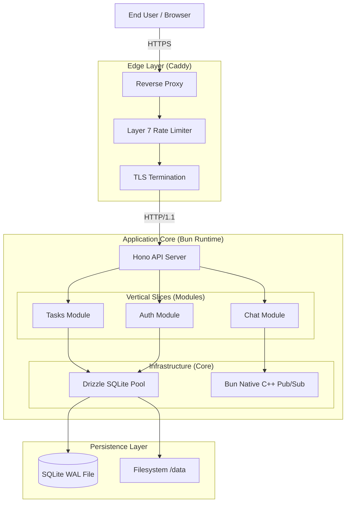
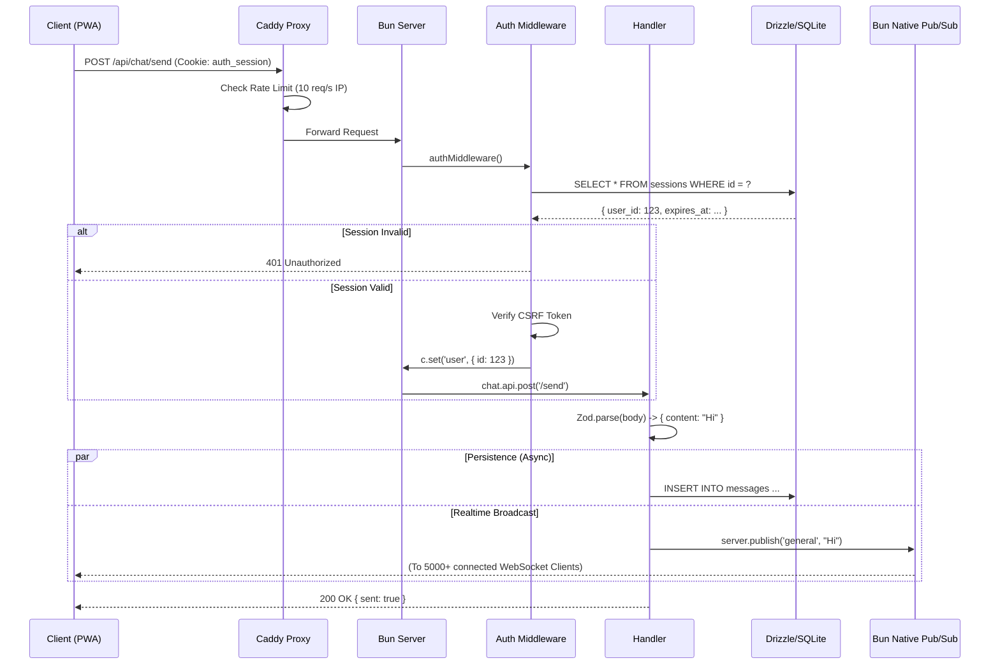

# 📘 LEAN MEAN VPS - The Ultimate Technical Reference

> **Version:** 3.0.0 (The Bible Edition)
> **Status:** Production Ready
> **Target Audience:** Principal Software Engineers, Solutions Architects, CTOs
> **Mission:** Maximum Performance & Security on Minimal Hardware (1 vCPU, 512MB RAM).

---

## 📑 Inhaltsverzeichnis

1.  [Philosophie & Core Principles](#1-philosophie--core-principles)
2.  [System Architektur (High-Level)](#2-system-architektur-high-level)
3.  [Request Lifecycle (Deep Dive)](#3-request-lifecycle-deep-dive)
4.  [Design-Entscheidungen & Rechtfertigungen](#4-design-entscheidungen--rechtfertigungen)
5.  [Performance Secrets](#5-performance-secrets)
6.  [Security Architecture](#6-security-architecture)
7.  [Operational Excellence](#7-operational-excellence)
8.  [Developer Guide (How-To)](#8-developer-guide-how-to)
9.  [FAQ & Troubleshooting](#9-faq--troubleshooting)

---

## 1. Philosophie & Core Principles

Dieses Framework ist eine Antithese zu modernen Cloud-Native Stacks, die oft unnötige Komplexität ("Bloat") mit sich bringen.

### Das "Zero-Bloat" Manifest
1.  **Hardware is King:** Software muss sich der Hardware anpassen, nicht umgekehrt. Wir zielen auf 512MB RAM. Jedes Byte Overhead (Docker, K8s, JVM) ist ein Byte, das der App fehlt.
2.  **Vertical Slices > Horizontal Layers:** Features werden vertikal geschnitten (UI + API + DB), nicht horizontal (Controller + Service + Repo). Das reduziert Kontext-Wechsel und Code-Spaghetti.
3.  **Native Power:** Wir nutzen Features der Runtime (Bun Pub/Sub, SQLite WAL), statt externe Dependencies (Redis, Postgres) zu laden.

---

## 2. System Architektur (High-Level)

Das System besteht aus einem einzigen monolithischen Binary (`lean-server`), das hinter einem Reverse Proxy (`Caddy`) läuft.



---

## 3. Request Lifecycle (Deep Dive)

Was passiert *exakt*, wenn ein User eine Aktion ausführt?

### Szenario: User sendet Chat-Nachricht (POST /api/chat/send)



---

## 4. Design-Entscheidungen & Rechtfertigungen

Hier rechtfertigen wir jede Abweichung vom "Standard".

### 4.1 Warum Bun statt Node.js?
*   **Startup Time:** Bun startet in <50ms. Node.js braucht oft >500ms. Das ist kritisch für schnelle Restarts auf einem VPS.
*   **Native WebSockets:** Bun implementiert WebSockets in C++/Zig. Node.js Bibliotheken (`ws`, `socket.io`) laufen im JS-Heap. Bei 5000 Verbindungen spart Bun hunderte MB RAM.
*   **Tooling:** Bun ist Package Manager, Bundler und Runtime. Wir sparen uns `npm`, `webpack`, `dotenv` und `tsx`. Weniger Dependencies = Weniger RAM.

### 4.2 Warum SQLite (WAL) statt PostgreSQL?
*   **Der Mythos:** "SQLite ist nicht für Production." -> **Falsch.**
*   **Die Realität:** Im WAL-Mode (Write-Ahead Logging) kann SQLite tausende Reads pro Sekunde bedienen.
*   **Der Grund:** Postgres verbraucht ~100MB RAM im Leerlauf (Process Overhead). SQLite verbraucht 0MB (es ist eine Library).
*   **Trade-off:** Wir haben kein Horizontal Scaling. Aber bis wir >100k User haben, reicht ein 4GB RAM VPS für 20€/Monat.

### 4.3 Warum HonoX statt Next.js?
*   **Next.js:** Erfordert Node.js Server oder Vercel. Schwergewichtig (React Server Components Overhead).
*   **HonoX:** Baut auf Web Standards. Extrem leicht (~15KB). Erlaubt uns, denselben Router für API und SSR zu nutzen.
*   **Islands Architecture:** Wir senden HTML. JavaScript wird nur dort geladen, wo Interaktion nötig ist (`islands/`). Das spart Bandbreite und CPU beim Client.

---

## 5. Performance Secrets

Wie erreichen wir diese Performance auf 512MB?

### 5.1 Native Pub/Sub ("The Pneumatic Tube")
Statt Nachrichten in einer JS-Schleife zu verteilen (`clients.forEach(c => c.send(msg))`), rufen wir `ws.publish(topic, msg)` auf.
Bun übernimmt das Broadcasting im nativen Code. Das entlastet den JS Event-Loop komplett.

### 5.2 Build-Time DB Proxy
Damit Vite (das in Node läuft) unsere App bauen kann, obwohl `bun:sqlite` (Native Bun) importiert wird, nutzen wir einen Proxy (`app/core/db/index.ts`).
Dieser Proxy "fängt" alle DB-Aufrufe während des Builds ab und gibt `undefined` zurück. Das erlaubt SSG ohne DB-Verbindung.

### 5.3 Streaming File Uploads
Wir laden Dateien nie komplett in den RAM.
*   **Upload:** Der Stream vom Client wird direkt auf die Festplatte gepiped (`Bun.write`).
*   **Download:** Wir nutzen `Bun.file(path).stream()`, was "Zero-Copy" Networking ermöglicht (Kernel sendet Datei direkt an Socket).

---

## 6. Security Architecture

Sicherheit ist kein Feature, sondern Core.

### 6.1 Authentication Hardening
*   **Argon2id:** Der Goldstandard für Passwort-Hashing.
*   **Parameter:** `memoryCost: 32768` (32MB). Sicherheit gegen GPU-Cracking.
*   **OOM Protection:** Da 32MB viel ist, nutzen wir `p-limit` (`app/core/lib/password.ts`), um maximal 2 parallele Logins zu erlauben. Sonst würde ein Angreifer mit 20 Requests den Server crashen (20 * 32MB > 512MB).

### 6.2 Timing Attack Mitigation
Angreifer könnten messen, wie lange der Login dauert, um zu erraten, ob ein User existiert.
*   **Lösung:** Wenn der User nicht gefunden wird, berechnen wir trotzdem einen Hash (gegen einen Dummy-String). Die Antwortzeit bleibt konstant.

### 6.3 Session Cleanup
Wir nutzen keinen Cron-Job (spart RAM).
*   **Probabilistik:** Bei jeder Session-Erstellung gibt es eine 1% Chance, dass alte Sessions gelöscht werden (`DELETE FROM sessions WHERE expires < NOW`).
*   **Vorteil:** Self-Cleaning System ohne externe Prozesse.

---

## 7. Operational Excellence

Wie betreibe ich das Ding?

### 7.1 Caddyfile Erklärung
```caddyfile
domain.com {
    encode zstd gzip          # Kompression spart Traffic
    rate_limit {              # DDoS Schutz (Layer 7)
        events 20             # Max 20 Requests
        window 1s             # Pro Sekunde
    }
    reverse_proxy localhost:3000
}
```

### 7.2 Systemd Unit
```ini
[Service]
ExecStart=/app/lean-server
MemoryMax=400M            # Hard Limit: Kill before Freeze
Restart=always            # Auto-Recovery
```

---

## 8. Developer Guide (How-To)

### Neues Feature erstellen
1.  Ordner: `app/modules/mein-feature`
2.  Schema: `schema.ts` (DB Tabellen)
3.  API: `api.ts` (Hono Routes)
4.  UI: `islands/` (Interaktiv) oder `app/components/` (Statisch)

### Regeln
*   **Keine Cross-Imports:** Module dürfen keine Logik voneinander importieren.
*   **Type-Safety:** Imports von `schema.ts` sind erlaubt, um Typen zu teilen.
*   **Cleanup:** Um ein Feature zu löschen, lösche einfach den Ordner und entferne die Referenz in `app/db.ts`.

---

## 9. FAQ & Troubleshooting

**F: Kann ich das auf AWS Lambda deployen?**
A: Nein. Dies ist für Stateful VPS (SQLite, WebSockets) designet.

**F: Was passiert, wenn der Server neustartet?**
A: WebSockets reconnecten automatisch (Client-Side Logic). Downtime ist <500ms.

**F: Warum sehe ich TypeScript Fehler bei `ws.data`?**
A: Bun's Typen und Hono's Wrapper sind nicht 100% synchron. Wir nutzen `@ts-expect-error` an diesen Stellen. Das ist bekannt und sicher.

---

**LEAN MEAN VPS** - Weil Software effizient sein sollte.
