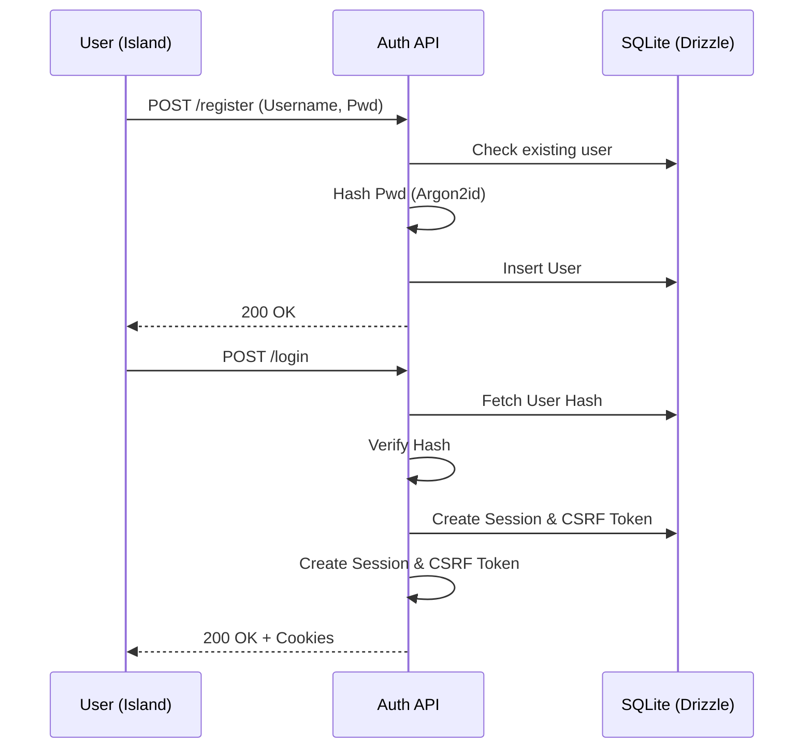
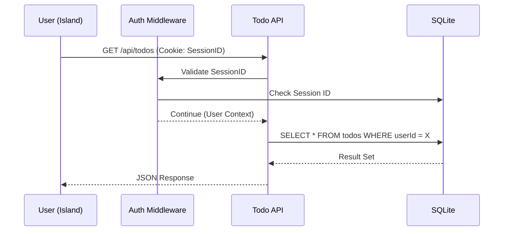
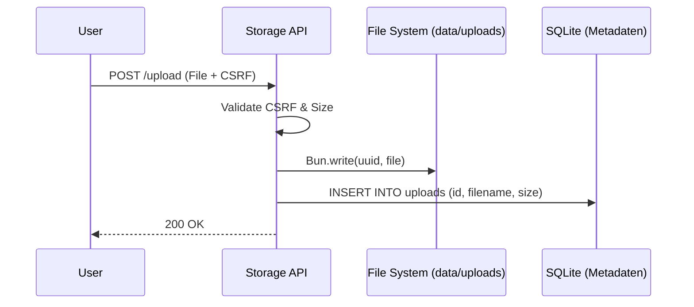

# 🤖 AI Agents Dokumentation - LEAN MEAN VPS Template

> Richtlinien für AI-Agenten zur Arbeit mit diesem Framework.

## 📋 Projekt-Philosophie (2026 Edition)

Dieses Template ist auf **absolute Effizienz** getrimmt. Ziel ist ein Fullstack-System, das auf einem **512MB RAM VPS** stabil läuft und gleichzeitig modernste Sicherheitsstandards erfüllt.

### Kern-Prinzipien
1. **SSG First**: Seiten werden statisch generiert (HonoX SSG).
2. **SQLite WAL**: Datenbank ist lokal, typsicher (Drizzle) und performant.
3. **No Bloat**: Keine unnötigen Bibliotheken. Tailwind 4 + Bun native APIs.
4. **Islands**: Client-JS nur dort, wo Interaktion stattfindet.

---

## 🏗️ Architektur-Flows (Sequence Diagrams)

### 1. Signup & Auth Flow

### 2. Datenbank-Zugriff & CRUD

### 3. File Storage (Lean Design)

---

## 🔧 Coding Conventions für Agents

- **Kommentare**: Jede Datei MUSS oben einen Header haben (WAS, WIE, WARUM).
- **Security**: Nutze IMMER die `authMiddleware` und `csrfMiddleware` für schreibende API-Zugriffe.
- **UI**: Nutze ausschließlich die Komponenten aus `app/components/UI.tsx`. Keine In-Line Styles.
- **Framework**: HonoX für Routing & SSG, Bun für Runtime & Hashing.

