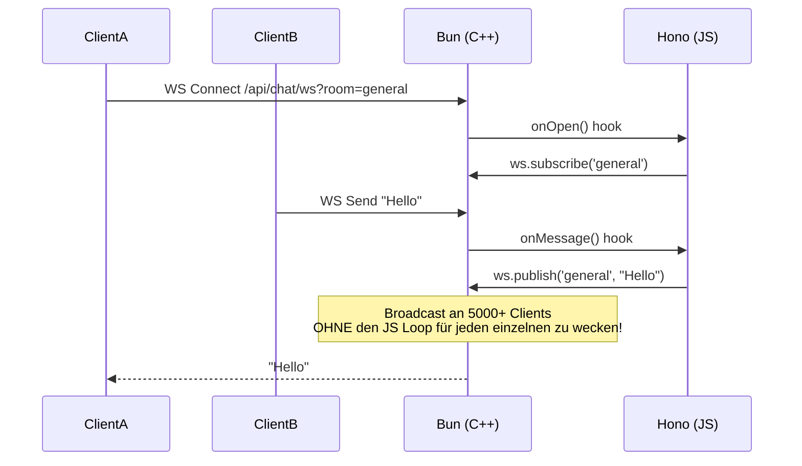

# Realtime Chat Modul (Bun Native Pub/Sub)

> **Rolle:** High-Concurrency Echtzeit-Kommunikation
> **Tech:** Bun Native WebSockets + Pub/Sub

## 1. Warum Bun Native Pub/Sub?

Auf einem limitierten 512MB RAM Server verwalten traditionelle Node.js WebSocket Bibliotheken (wie `ws` oder `socket.io`) Verbindungen im JavaScript Heap.

**Das Problem:**
Das Handling von 5000+ Verbindungen in JS erzeugt massiven GC (Garbage Collection) Druck, verursacht CPU-Spikes und friert schließlich die einzelne vCPU ein.

**Die Lösung:**
Bun's `server.publish()` verschiebt die Logik für das Nachrichten-Broadcasting in **nativen C++/Zig Code**.
*   **Zero-Copy:** Nachrichten werden nicht für jeden Client in JS geklont.
*   **Off-Main-Thread:** Networking passiert unabhängig vom JS Event Loop.
*   **Speicher:** Drastisch geringerer Overhead pro Verbindung.

## 2. Architektur



## 3. Implementierungs-Details

### Das Setup (`api.ts`)
Wir nutzen `createBunWebSocket` von `hono/bun`.
Wichtig: Das `websocket` Objekt muss exportiert und an `Bun.serve` in `app/api-server.ts` übergeben werden.

```typescript
// app/api-server.ts
export default {
  fetch: app.fetch,
  websocket, // <--- HIER PASSIERT DIE MAGIE
};
```

### Räume (Topics)
Bun nutzt String-basierte Topics. Wir mappen "Räume" direkt auf Topics.
*   `ws.subscribe("general")`
*   `ws.publish("general", data)`

### Authentifizierung
Da WebSockets mit einem HTTP Upgrade Request starten, parsen wir manuell den `Cookie` Header im `onOpen` Hook, um die Session gegen SQLite zu validieren.
