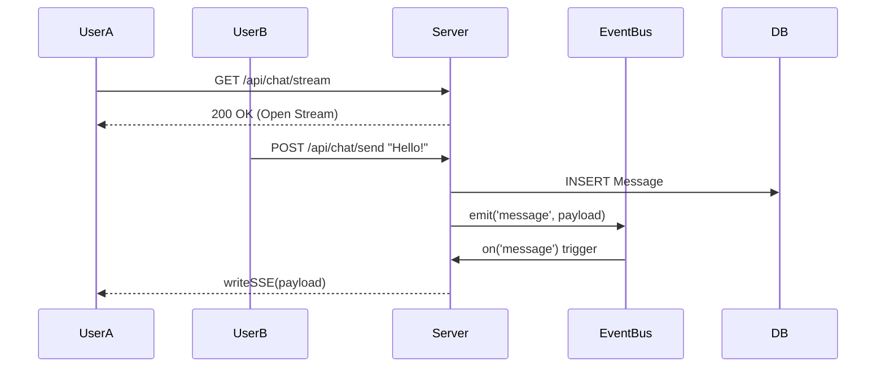

# Realtime Chat Module (SSE)

> **Role:** Low-Latency Communication
> **Tech:** Server-Sent Events (SSE) + Event Emitter

## 1. Why SSE and not WebSockets?

On a constrained 512MB RAM server, connection overhead matters.

| Feature | WebSockets (WS) | Server-Sent Events (SSE) |
| :--- | :--- | :--- |
| **Protocol** | TCP Upgrade (Stateful) | HTTP (Stateless-ish) |
| **Direction** | Bidirectional | Server -> Client |
| **Reconnect** | Manual Logic required | Built-in (Browser) |
| **Overhead** | High (Ping/Pong Frames) | Low (Text Stream) |

**Decision:** We use SSE for the downstream (receiving messages) and standard HTTP POST for sending. This is the "HTMX-way" of thinking and fits the LEAN architecture perfectly.

## 2. Architecture



## 3. Implementation Details

### The Event Bus (`chatBus`)
We use a Node.js `EventEmitter` singleton in `api.ts`.
*   **Capacity:** `setMaxListeners(1000)` allows up to 1000 concurrent connected users on a single node.
*   **Scaling:** If scaling beyond one VPS, this `EventEmitter` would be replaced by Redis Pub/Sub. But for a single VPS, in-memory is infinitely faster (0ms latency).

### Keep-Alive
To prevent Load Balancers (like Nginx/Caddy) from closing the idle connection, we send a "heartbeat" every 15 seconds.

```typescript
setInterval(() => {
  stream.writeSSE({ event: 'ping', data: '' });
}, 15000);
```
