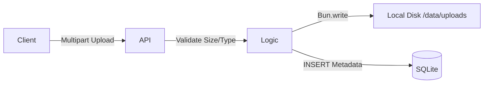

# Storage Module (Filesystem)

> **Role:** Managing Binary Assets
> **Constraint:** 512MB RAM Limit (Streaming required)

## 1. Architecture

Unlike cloud-native apps (S3), this module stores files on the **local VPS filesystem** to save costs and reduce latency.



## 2. API Specifications

### `POST /api/storage/upload`
*   **Body:** `multipart/form-data` (`file` field).
*   **Validation:**
    *   Max Size: 10MB (Enforced via Zod).
    *   File Type: All types allowed (stored with mime-type).
*   **Safety:**
    *   Original filename is **never** used on disk.
    *   Storage Path: `data/uploads/{UUID}`.
    *   Prevents `../../etc/passwd` path traversal attacks.

### `GET /api/storage/download/:id`
*   **Mechanism:** Zero-Copy Streaming.
*   **Implementation:**
    ```typescript
    // app/modules/storage/api.ts
    const file = Bun.file(path);
    return c.body(file.stream());
    ```
*   **Memory Impact:** Uses minimal RAM. Node.js `fs.readFileSync` would load the entire file into RAM (Bad for 512MB server). Bun streams it directly from disk to socket.

## 3. Metadata Schema

```sql
CREATE TABLE uploads (
  id TEXT PRIMARY KEY, -- UUIDv4
  user_id INTEGER NOT NULL,
  filename TEXT NOT NULL, -- Original user filename (for display)
  size INTEGER NOT NULL,
  mime_type TEXT NOT NULL
);
```
