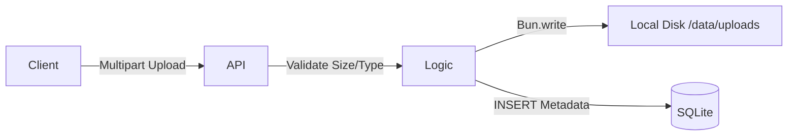

# Storage Modul (Dateisystem)

> **Rolle:** Verwaltung von binären Assets
> **Einschränkung:** 512MB RAM Limit (Streaming erforderlich)

## 1. Architektur

Anders als Cloud-native Apps (S3), speichert dieses Modul Dateien auf dem **lokalen VPS Dateisystem**, um Kosten zu sparen und Latenz zu reduzieren.



## 2. API Spezifikationen

### `POST /api/storage/upload`
*   **Body:** `multipart/form-data` (`file` Feld).
*   **Validierung:**
    *   Max Größe: 10MB (Erzwungen via Zod).
    *   Dateityp: Alle Typen erlaubt (gespeichert mit MIME-Type).
*   **Sicherheit:**
    *   Original-Dateiname wird **niemals** auf der Festplatte verwendet.
    *   Speicherpfad: `data/uploads/{UUID}`.
    *   Verhindert `../../etc/passwd` Path Traversal Angriffe.

### `GET /api/storage/download/:id`
*   **Mechanismus:** Zero-Copy Streaming.
*   **Implementierung:**
    ```typescript
    // app/modules/storage/api.ts
    const file = Bun.file(path);
    return c.body(file.stream());
    ```
*   **Speicher-Impact:** Nutzt minimal RAM. Node.js `fs.readFileSync` würde die gesamte Datei in den RAM laden (Schlecht für 512MB Server). Bun streamt direkt von Disk zu Socket.

## 3. Metadaten Schema

```sql
CREATE TABLE uploads (
  id TEXT PRIMARY KEY, -- UUIDv4
  user_id INTEGER NOT NULL,
  filename TEXT NOT NULL, -- Originaler User-Dateiname (für Anzeige)
  size INTEGER NOT NULL,
  mime_type TEXT NOT NULL
);
```
