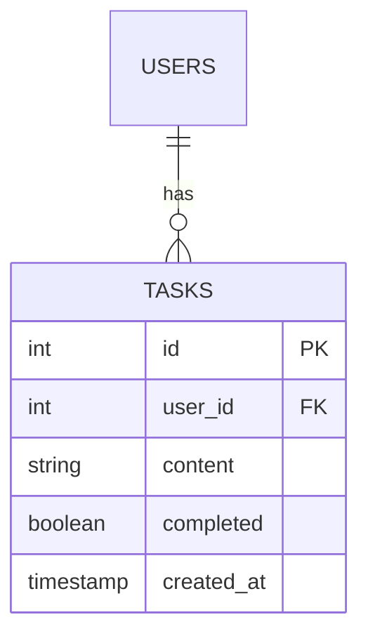

# Tasks Modul (CRUD Beispiel)

> **Rolle:** Demo für Standard CRUD Operationen
> **Tech Stack:** Drizzle ORM, Zod Validierung, Optimistic UI

## 1. Datenmodell (ERD)

Strikte Beziehung zur `users` Tabelle via Foreign Key.



## 2. API Spezifikationen

Alle Endpunkte erfordern `Session Auth` Header.

### `GET /api/tasks`
Gibt alle Aufgaben des *aktuellen* Benutzers zurück.
*   **Response:** `200 OK` `{ success: true, data: Task[] }`
*   **Performance:** Indizierte Abfrage auf `user_id`.

### `PATCH /api/tasks/:id/toggle`
Atomarer Status-Wechsel.
*   **Implementierung:**
    ```typescript
    // Atomares SQL-Update verhindert Race Conditions
    db.update(tasks).set({
      completed: sql`NOT ${tasks.completed}`
    })
    ```
*   **Warum:** Traditionelle "Read -> Modify -> Save" Logik ist anfällig für Race Conditions, wenn ein User schnell doppelt klickt. SQL-Level Toggling ist strikt atomar.

## 3. Client-Side Strategie (TodoIsland.tsx)

### Offline Support & Queueing
Die UI nutzt `app/core/lib/offline.ts`.
1.  **Intercept:** Wenn `fetch` fehlschlägt (Netzwerkfehler), wird der Request serialisiert.
2.  **Queue:** Gespeichert in `localStorage` (`mutation_queue`).
3.  **Optimistic Update:** Die UI aktualisiert sofort (`setTodos(...)`) unter Annahme des Erfolgs.
4.  **Sync:** Bei Rückkehr der Verbindung wird die Queue FIFO abgearbeitet.
