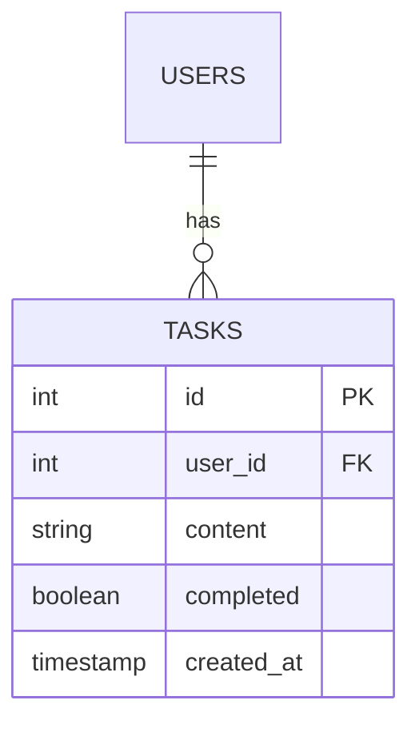

# Tasks Module (CRUD Example)

> **Role:** Demo of Standard CRUD Operations
> **Tech Stack:** Drizzle ORM, Zod Validation, Optimistic UI

## 1. Data Model (ERD)

Strict relationship with `users` table via Foreign Key.



## 2. API Specifications

All endpoints require `Session Auth` headers.

### `GET /api/tasks`
Returns all tasks for the *current* user.
*   **Response:** `200 OK` `{ success: true, data: Task[] }`
*   **Performance:** Indexed query on `user_id`.

### `PATCH /api/tasks/:id/toggle`
Atomic status toggle.
*   **Implementation:**
    ```typescript
    // Atomic SQL update prevents race conditions
    db.update(tasks).set({
      completed: sql`NOT ${tasks.completed}`
    })
    ```
*   **Why:** Traditional "Read -> Modify -> Save" logic is vulnerable to race conditions if a user clicks twice rapidly. SQL-level toggling is strictly atomic.

## 3. Client-Side Strategy (TodoIsland.tsx)

### Offline Support & Queueing
The UI uses `app/core/lib/offline.ts`.
1.  **Intercept:** When `fetch` fails (Network Error), the request is serialized.
2.  **Queue:** Stored in `localStorage` (`mutation_queue`).
3.  **Optimistic Update:** The UI updates immediately (`setTodos(...)`) assuming success.
4.  **Sync:** When connectivity returns, the queue is processed FIFO.
